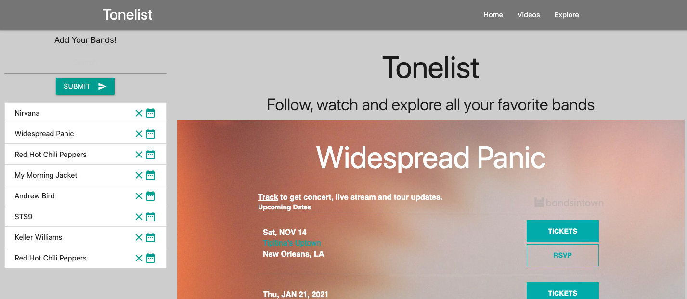
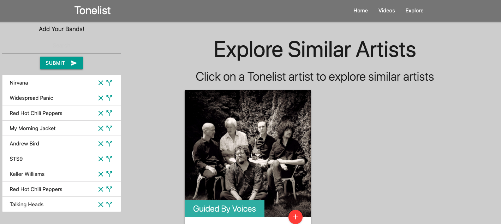
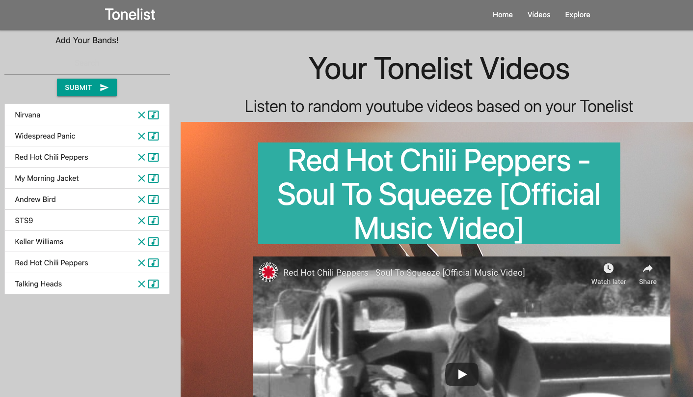

# Project1
Our first project for the UCSD Extension Full Stack Web Dev Course

This website can be used to store your favorite bands and find info like tour dates, videos and similar artists.

# Installation

1. Open Browser
2. Navigate to https://alignsd.github.io/Tonelist/index.html

# Usages

- Giving 100% on project
- Displaying 3rd-party API logic
- Displaying tour dates for favorite bands
- Displaying videos for favorite bands
- Displaying similar artists for favorite bands

# Credits

- naldz - https://naldzgraphics.net/free-weather-icons/
- openweather - https://openweathermap.org/api
- materialize - https://materializecss.com/
- jquery - https://jquery.com/
- bandsintown - https://www.bandsintown.com/
- youtube - https://www.youtube.com/
- tastedive - tastedive.com